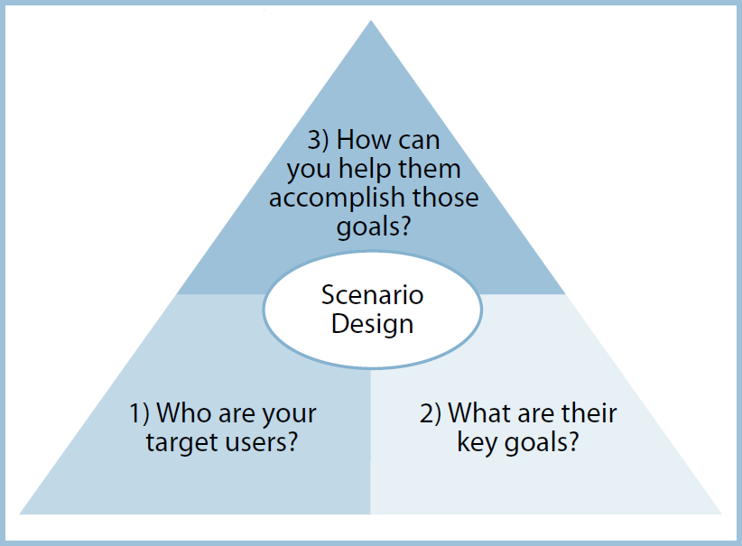
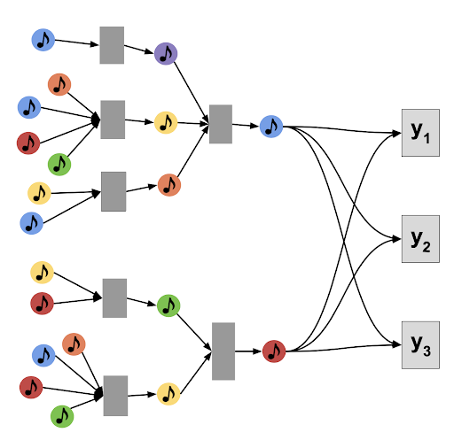

```{r setup, include=FALSE}
knitr::opts_chunk$set(echo = TRUE)
```

## Overview

Our task was to analyze an existing recommender system that we find interesting.  

We should:

  1. Perform a Scenario Design analysis as described below.  Consider whether it makes sense for our selected recommender system to perform scenario design twice, once for the organization (e.g. Amazon.com) and once for the organization's customers.
  2. Attempt to reverse engineer what we can about the site, from the site interface and any available information that you can find on the Internet or elsewhere.
  3. Include specific recommendations about how to improve the site's recommendation capabilities going forward. 
  4. Create our report using an R Markdown file, and create a discussion thread with a link to the GitHub repo where our Markdown file notebook resides.  We were not expected to need to write code for this discussion assignment.

## How to Perform a Scenario Analysis:

Scenario Design is an easy-to-use “three question framework” that helps us in making sure that the information in our analysis work takes UX (user experience) into account:



*Source: “Scenario Design:  A Disciplined Approach to Customer Experience,” Bruce D. Temkin, Forrester Research, 2004.*  
Temkin notes that before applying Scenario Design, one might ask, “What functionality should we offer?”  After applying Scenario Design, one might instead ask, “What user goals should we serve?”

Our task is to:

  1. Identify a recommender system web site, then
  2. Answer the three scenario design questions for this web site.
  
This process of guessing/reverse engineering, while inexact, will help us build out your own ability to better account for “user needs” in designing recommender systems going forward.  Being able to place the customer first in your mind is a “soft skill” that is highly valued in the technical marketplace.

## Spotify Recommender System

Spotify has capitalized on utilizing a recommender system for the personalization aspect of its service. When it was first founded in 2006, it had aspirations to become a music library, personalization came later. 

  **1) Who are the target users?**
  
  Target users are those who listen to spotify regularly, their listening history, music choices, play duration for certain songs and past response to recommendations. This is what comprises the *"Discover Weekly"* playlists. 

  **2) What are the key goals?**
  
  Key goals are to model user behavior on the app by projecting in-app activities into human traits and emotion, using aspects like mood or time of day, week or season for recommendations. Spotify also conducts intricate musical analysis, using a machine learning algorithm [approximate nearest neighbor search!](https://research.atspotify.com/multi-task-learning-of-graph-based-inductive-representations-of-music-content/) to group songs and users together based on shared attributes or qualities. Each song has attributes such as danceability, energy, liveness, loudness, instrumentalness etc... They called this MUSIG, which is a multi-task formulation of graph representation that learns to track representations both on feature content, and structural graph neighborhoods.
  
Here is a visual example from the linked article above:



*Source: Antonia Saravanou, Federico Tomasi, Rishabh Mehrotra & Mounia Lalmas. Multi-Task Learning of Graph-based Inductive Representations of Music Content.*

This shows how the model learns parameters of functions based on multiple complementary tasks. It's divided into two key steps:

-   **Neighborhood aggregator** step which based on search depth aggregates information from different nodes in multiple hops away from a given node

-   **Multi-task supervision step** predicts multiple tasks, and back propagates combined losses to aggregator function parameters. This in turn trains the model.

In laymen's terms, Oskar Stal, Spotify's VP of personalization, stated:

*“Imagine you and another person have four of the same top artists, but your fifth artists are different. We would take those two near-matches and think, ‘Hmm, maybe each person would like the other’s fifth artist’ and suggest it,” Stål explained in a [blog!](https://newsroom.spotify.com/2021-10-13/adding-that-extra-you-to-your-discovery-oskar-stal-spotify-vice-president-of-personalization-explains-how-it-works/). “Now imagine that process happening at scale—not just one-on-one, but thousands, millions of connections and preferences being considered instantaneously.”*
  
  
  **3) How can we help them accomplish their goals**
  
Well, as a user of Spotify myself, I actually love the Discover Weekly Playlist's, sometimes I don't want to decide what to listen too, and most of the time they are pretty dead on. They introduce me artists that I heard of but never listened too, or completely new ones. I also enjoy how if I listen to an entire album, it keeps playing and creates a *"Radio"* station based on the artist I was just listening too. So I think Spotify has accomplished their goal. 

As as any recommendations for improvement, I don't really see much. Perhaps if there was something that allowed you to directly specify an artist or genre and get a playlist developed for you sculpted to your preferences.


